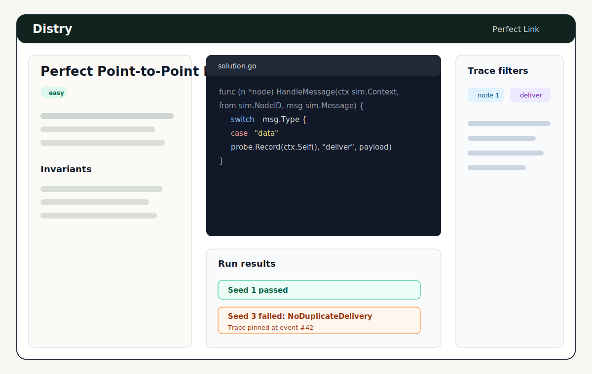
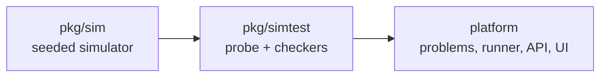

# Distry

Distry is a LeetCode-style platform for learning distributed systems by writing Go
algorithms against deterministic, seeded simulations. Pick a problem, edit the starter
solution in the browser, press Run, and inspect per-seed invariant results and traces.



## Architecture At A Glance



`pkg/sim` is the deterministic discrete-event simulator. It owns virtual time, seeded
network behavior, timers, partitions, crashes, and the trace event stream. See
[`docs/06-simulator-core.md`](docs/06-simulator-core.md).

`pkg/simtest` turns simulator traces and probe observations into problem reports. Problem
harnesses use it for safety and liveness checkers such as duplicate delivery, no creation,
agreement, single leader, and bounded termination. See
[`docs/07-invariants-and-harness.md`](docs/07-invariants-and-harness.md).

The platform layer loads problem manifests, stores user solutions, compiles submissions,
runs configured seeds, and renders the workspace UI. Start with the user guide in
[`docs/guide-solving-problems.md`](docs/guide-solving-problems.md) and the author guide in
[`docs/guide-authoring-problems.md`](docs/guide-authoring-problems.md).

## Quickstart

Prerequisites:

- Go 1.26.4 or newer.
- Node.js compatible with the checked-in lockfiles.
- PostgreSQL with a database URL in `DATABASE_URL`.
- Docker, for the disposable PostgreSQL database used by `make e2e`.

From a clean clone:

```sh
go mod download
npm ci
npm --prefix frontend ci
```

Create `.env` in the repo root with variable names only, and fill in values locally:

```sh
DATABASE_URL=
PORT=8080
```

Run migrations explicitly:

```sh
make migrate
```

Start the app:

```sh
make dev
```

Open `http://localhost:8080`, sign up with an email and password, choose **Perfect
Point-to-Point Link**, edit `solution.go`, click **Save**, then click **Run**. Use the
optional seed input next to **Run** to debug specific seeds, such as `7` or `7, 8`.
On a failed seed, expand the row and click **Replay** to rerun that seed from the
submission snapshot with a full trace.

## Development

| Path                    | Purpose                                              |
| ----------------------- | ---------------------------------------------------- |
| `cmd/server/`           | API and static frontend server entrypoint            |
| `cmd/migrate/`          | Goose migration command                              |
| `internal/config/`      | `.env` and environment loading                       |
| `internal/db/`          | pgx pool and embedded migrations                     |
| `internal/auth/`        | email/password users, sessions, middleware           |
| `internal/problems/`    | manifests, loader, repository, API shape             |
| `internal/solutions/`   | saved user solution files                            |
| `internal/runner/`      | compile/run workspaces for submissions               |
| `internal/submissions/` | submission lifecycle and reports                     |
| `pkg/sim/`              | public deterministic simulator API                   |
| `pkg/simtest/`          | public probe, checkers, harness helpers              |
| `problems/`             | manifests, descriptions, templates, hidden harnesses |
| `frontend/`             | React workspace UI                                   |
| `docs/`                 | plans and platform guides                            |

Common checks:

```sh
make test
make test-integration
make e2e
make examples
```

`make test` runs the regular Go suite, frontend typecheck, and frontend tests.
`make test-integration` runs tests guarded by the `integration` build tag. `make examples`
builds documented example packages. `make e2e` starts a disposable Docker PostgreSQL
container, migrates that fresh database, starts the server, signs up a test user, runs
correct and buggy fixtures for all three problems, and checks replay on a failed seed.

## Project Status

See [`docs/backlog.md`](docs/backlog.md) for the current roadmap, including runner
sandboxing, additional languages, richer trace visualization, progression, seed fuzzing,
and importing more book chapters.
